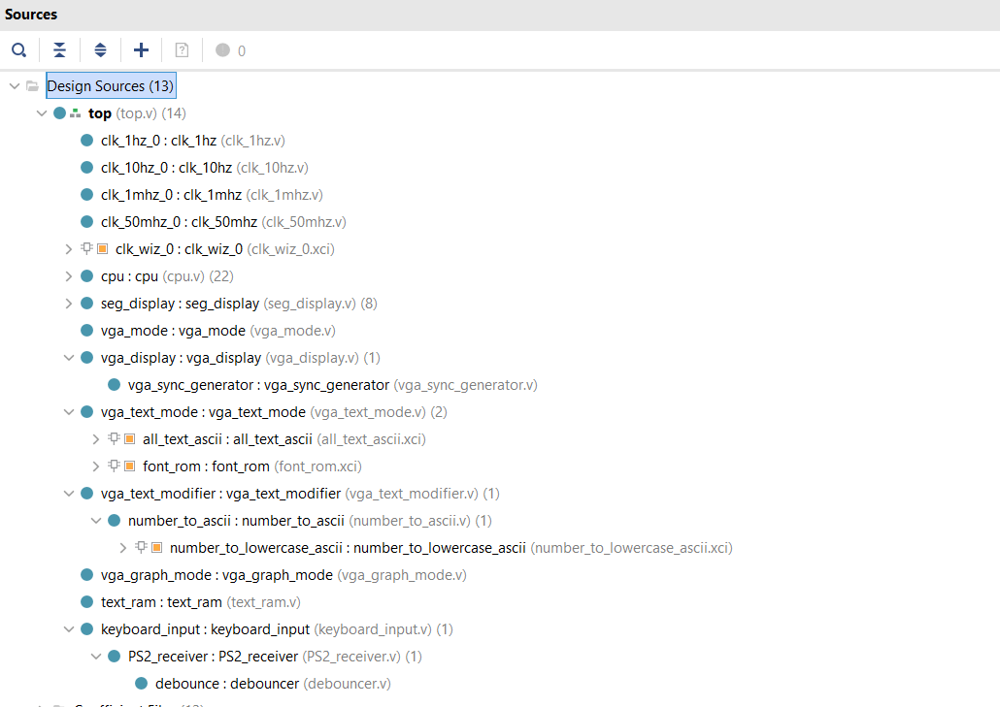

# Base64 编码器

## 简介

这是我的计算机组成原理课的期末大作业。我的作品是一个实时 Base64 编码器，主要内容是使用 Verilog 在 Nexys 4 DDR 开发板上实现流水线 CPU、完成对 VGA 显示器和键盘的支持、编写 Base64 编码器的汇编程序并把对应的机器码存储到 Memory 作为 CPU 的初始指令。

[](./Base64_Encoder.mp4)

点击[这里](./Base64_Encoder.mp4)或上图观看视频。

下面摘录我当时提交的实验报告。

## 实验报告

### 1. 实验简介

本项目名称为`实时 Base64 编码器`，连接 VGA 显示器和键盘（需要支持 HIB USB 协议）后，在屏幕左侧区域内输入文本，右侧区域实时显示左侧文本的 Base64 编码，最右侧实时显示 CPU 的寄存器、指令、PC。

### 2. 实验思路

Design Sources 如下图。



项目的工作量主要在这些地方：流水线 CPU、VGA 字符模式、VGA 文本输入（支持 Shift 键）、MIPS 下的 Base64 编码，下面分别介绍之。

#### 流水线 CPU

MIPS 五级流水线设计，参考了一个国外大学的课件和设计图，我做了一定修改，最终我的设计总图如下。


重点是 harzard 部分，主要思路见下图。


#### VGA 字符模式

为了实现 VGA 的文本模式，我选择了`8x16`的字符显示方式，整个屏幕一共显示 240 列、68 行，一共可以显示 16320 个字符。我从 Github 上下载到了一个`8x16`点阵字体的 Rom 文件，可以直接根据一个字符的 Ascii 码获得一共 8x16 = 128 个像素点的颜色信息：1（白）或 0（黑）。

实现的大致思路是，在`vga_text_mode`模块，首先使用一个 RAM 存储着所有的字符（68 行、240 列）的 Ascii 码，一方面这个 RAM 提供修改写接口（写使能、地址、数据），其他模块如果想在屏幕上改变文本，调用这个 RAM 的写接口；另一方面，这个 RAM 提供读接口用于显示文本，基本思路是，`vga_display`提供`vaddr_x`和`vaddr_x`，即要显示的像素点的地址（范围是 0 - 1919、0 - 1080），`vga_text_mode`获取这个地址后，利用相关数学关系得到“字符坐标”（范围是 0 - 239、0 - 67）、“字符内坐标”（范围是 0 - 7、0 - 15），利用“字符坐标”从 RAM 中得到字符的 Ascii 码，利用“字符内坐标”结合 Ascii 码得到那个像素点的信息（黑 or 白），将`vdata`送到`vga_display`。

#### VGA 文本输入

这一部分花费时间很多，主要麻烦的地方在于，和键盘打打交道的时候有好多细节，就单拿对 Shift 键的处理来说，用户先按 Shift 还是先按字符按键这个的顺序没问题，但是用户是先松开 Shift 还是先松开字符按键，这两种情况就大不一样了。起初，我的程序只能处理好用户先松开 Shift 再松开字符按键的情况，另一种情况会多打一个空格，后来自己 Debug 好久，才终于解决。

还有一个要注意的地方是，文本输入模块`keyboard_input`输出了两个数据，一个是用户按下的字符的 Ascii 码`data`，另一个是输入有效使能`valid_shock`，后者需要特别注意，就是它只能持续一个时钟周期，相当于在`clk`的上升沿，如果检测到`valid_shock`为`1`，就认为已经输入了一个按键，如果`valid_shock`在下一个`clk`的上升沿不变成`0`，就会认为又输入了相同的按键。

#### MIPS 下的 Base64 编码

这部分的内容是编写汇编程序，将文本实时编码成 Base64。为了让 CPU 能够得到和输出数据，我采用了 IO Mapping 的方法，具体做法是：内存地址`1024` , `1028`, `1032`, `1036`, `1040`, `1044`分别映射到 CPU 要获取的字符地址、CPU 在那个地址得到的字符的 Ascii 编码、CPU 输出字符使能、CPU 输出字符的地址、CPU 输出的字符、输入区的总字符数量。

核心算法（伪代码）如下：

```
begin:
    input_loc = 0
    output_loc = 0

    while (input_loc + 2 < total_num)
        a = [input_loc]
        b = [input_loc + 1]
        c = [input_loc + 2]

        d = a[7:2]
        e = {a[1:0],b[7:4]}
        f = {b[3:0],c[7:6]}
        g = c[5:0]

        input_loc = input_loc + 3
    

    if (input_loc + 1) = total_num 
	# one is more, that is [input_loc]
		
		# process it (omitted)
		
        j next

	next:
    if (input_loc + 2) = total_num 
	# two is more, they are [input_loc] [input_loc+1]
        
        # process it (omitted)
        
        j begin
    
    j begin
```

最终的汇编代码 [base64.asm](./base64.asm)。

### 3. 仿真截图

编写仿真文件的时候，我将要编码的文本设置成我的邮箱：`yulei2018@gmail.com`，为了验证我的 Base64 编码的正确性，使用在线编码网站，得到其 Base64 编码：`eXVsZWkyMDE4QGdtYWlsLmNvbQ==`。如下图。


写一个小脚本，得到这个字符串每一个字符的 Ascii 编码：

```
// eXVsZWkyMDE4QGdtYWlsLmNvbQ==
// 0:ascii = 101;
// 1:ascii = 88;
// 2:ascii = 86;
// 3:ascii = 115;
// 4:ascii = 90;
// 5:ascii = 87;
// 6:ascii = 107;
// 7:ascii = 121;
// 8:ascii = 77;
// 9:ascii = 68;
// 10:ascii = 69;
// 11:ascii = 52;
// 12:ascii = 81;
// 13:ascii = 71;
// 14:ascii = 100;
// 15:ascii = 116;
// 16:ascii = 89;
// 17:ascii = 87;
// 18:ascii = 108;
// 19:ascii = 115;
// 20:ascii = 76;
// 21:ascii = 109;
// 22:ascii = 78;
// 23:ascii = 118;
// 24:ascii = 98;
// 25:ascii = 81;
// 26:ascii = 61;
// 27:ascii = 61;
```

即`data_from_cpu`应该依次是 101、88、86、115、90、87……

仿真结果如下图，最下面一行即是 101、88、86、115……


### 4. 下载和结果分析

编码我的邮箱`yulei2018@gmail.com`。

[](./Base64_Encoder.mp4)

点击[这里](./Base64_Encoder.mp4)或上图观看视频。


### 5. 实验总结

-  Nexys 4 DDR 如果要接 USB 接口的键盘或鼠标，必须需要设备支持 HID USB 协议，基本原理是键鼠设备虽然有 USB 的接口， 但是是在模拟 PS/2 的行为。一开始我没有注意到这一点，试了机房键盘、自己的键盘一直都不行，最后在京东碰运气终于找到了可以用的；
-  本次实验我对 VGA 的显示做了较好的封装，分了 VGA Text Mode 和 VGA Graph Mode，其中还有一个模块根据像素的坐标来选择模式，对于 Text Mode，使用了一个 240x68 深的 RAM，里面存储着每一个字的 ASCII 码，而且还可以对字符进行修改；Graph Mode 亦是如此。如果之前做 VGA 相关的实验，能有这次的封装，工作量估计会小得多；
-  本次实验我也对键盘输入做了很好的封装，官方提供的一个 Demo 程序只能用来显示当前输入的字符的 PS/2 编码，而我对它又做了封装，使得它可以输出当前输入数据的 Ascii 编码、输入使能信号（刚好持续一个时钟周期），而且比较有成就感的是它还支持 Shift 按键，而且 Shift 键和字符键的按下、松开的先后顺序并不影响结果，这样的话，使用 Shfit 按键输入大小写字母、标点符号的体验还蛮不错；
-  Base64 编码的原理很简单，简单来讲，就是把三个字节用四个字符来显示，那这样做有哪些好处呢？可以想到，这样可以把不可用字符显示的东西使用字符显示或传输，适合二进制文件的传输；另外也是一个简单的文本加密过程（是伪加密，因为 Base64 编码是可逆的）；
-  组成原理实验结课万岁！